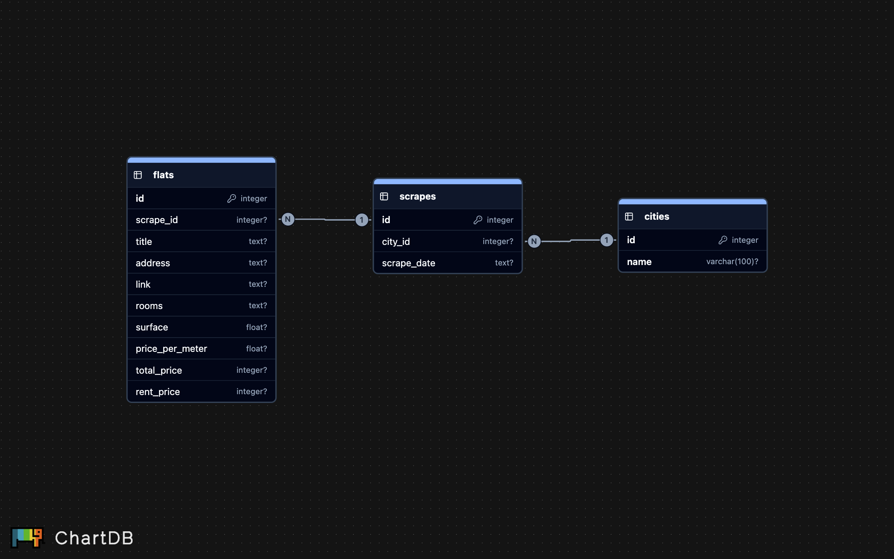

# Otodom Scraper

Python scraper for apartment listings from Otodom.pl. Results are stored in PostgreSQL using a relational schema that tracks daily scrapes per city. The scraper uses multithreading to speed up I/O-bound work and prevents duplicates by link.

## Features
- Multithreaded scraping (ThreadPoolExecutor)
- PostgreSQL storage with relational schema:
  - cities (unique city names)
  - scrapes (one row per city per run day)
  - flats (listings linked to a scrape)
- Duplicate prevention via UNIQUE(link) + ON CONFLICT DO NOTHING
- Rotating logs
- Optional daily scheduling via cron inside Docker

## Tech Stack
- Python 3.11
- requests, BeautifulSoup, geopy, unidecode
- psycopg2 (PostgreSQL)
- Docker + Docker Compose (work in progress)

## Database Schema


## Running locally (Python on host)
1) Start DB in Docker:
```bash
docker compose up -d db
```

2) Install deps locally:
```bash
python3 -m venv .venv
source .venv/bin/activate
pip install --no-cache-dir -r requirements.txt
```

3) Use the scraper programmatically:
```python
from utils.data_scrapper import OtodomScraper
import logging

def setup_logger(name="scraper", city=""):
    logger = logging.getLogger(name)
    logger.setLevel(logging.INFO)
    if not logger.handlers:
        ch = logging.StreamHandler()
        ch.setFormatter(logging.Formatter('%(threadName)s | %(asctime)s | [%(levelname)s] -> %(message)s'))
        logger.addHandler(ch)
    return logger

scraper = OtodomScraper(min_area=50, max_area=100, setup_logger=setup_logger, city="Gdańsk")
count = scraper.parse_data()
print("Inserted listings:", count)
```

By default the code connects to PostgreSQL at host localhost.

## Cron (optional)
The Docker image includes cron so you can schedule daily runs (e.g., 07:00).
## License
MIT
